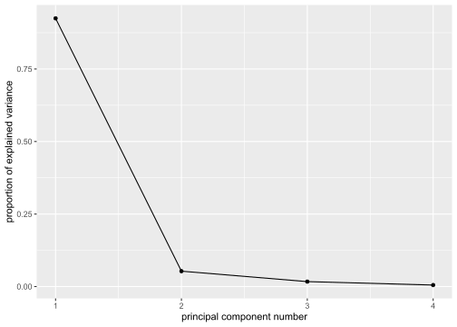
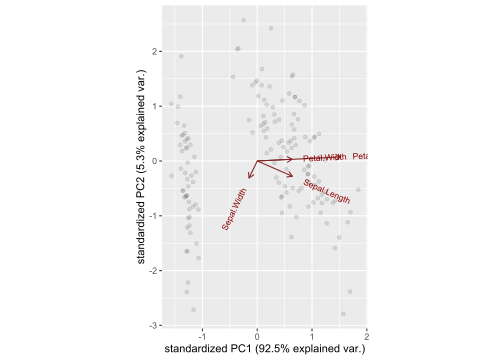
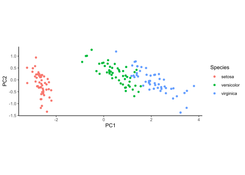

Report 8
================
Nathan Bana
(11 May, 2022)

This report uses the following R packages:

``` r
library(tidyverse)
library(knitr)
library(devtools)
library(ggbiplot)
```

In this report we will use the famous `iris` dataset. First, let’s run a
PCA:

``` r
iris.pca <- prcomp(iris[, 1:4], scale = F)
summary(iris.pca)
```

    ## Importance of components:
    ##                           PC1     PC2    PC3     PC4
    ## Standard deviation     2.0563 0.49262 0.2797 0.15439
    ## Proportion of Variance 0.9246 0.05307 0.0171 0.00521
    ## Cumulative Proportion  0.9246 0.97769 0.9948 1.00000

``` r
ggscreeplot(iris.pca)
```

<!-- -->

We see that the first 2 PCs explain almost the entirety of the variance
(over 97%). Therefore, we should only keep those 2. Let’s run a biplot:

``` r
ggbiplot(iris.pca, choices = 1:2, alpha = 0.1)
```

<!-- -->

We can clearly see 2 distinct groups of observations. We can also note
that petal length and petal width are very strongly positively
correlated.

Next, let’s add the PC scores to the original dataset:

``` r
iris.scores <- cbind(iris, iris.pca$x[, 1:2])
```

Now we can plot the PCs:

``` r
ggplot(iris.scores, aes(PC1, PC2, color = Species)) +
  geom_point() +
  coord_fixed() +
  theme_classic()
```

<!-- -->

Thanks to the coloring, we now see that there actually are 3 distinct
groups of observations.
