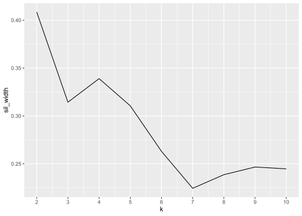

Report 9
================
Nathan Bana
(13 May, 2022)

This report uses the following R packages:

``` r
library(tidyverse)
library(knitr)
library(purrr)
library(cluster)
```

In this report we will be using the `USArrests` dataset. It contains
“statistics, in arrests per 100,000 residents for assault, murder, and
rape in each of the 50 US states in 1973. Also given is the percent of
the population living in urban areas.” (R Documentation).

``` r
kable(head(USArrests))
```

|            | Murder | Assault | UrbanPop | Rape |
|:-----------|-------:|--------:|---------:|-----:|
| Alabama    |   13.2 |     236 |       58 | 21.2 |
| Alaska     |   10.0 |     263 |       48 | 44.5 |
| Arizona    |    8.1 |     294 |       80 | 31.0 |
| Arkansas   |    8.8 |     190 |       50 | 19.5 |
| California |    9.0 |     276 |       91 | 40.6 |
| Colorado   |    7.9 |     204 |       78 | 38.7 |

``` r
str(USArrests)
```

    ## 'data.frame':    50 obs. of  4 variables:
    ##  $ Murder  : num  13.2 10 8.1 8.8 9 7.9 3.3 5.9 15.4 17.4 ...
    ##  $ Assault : int  236 263 294 190 276 204 110 238 335 211 ...
    ##  $ UrbanPop: int  58 48 80 50 91 78 77 72 80 60 ...
    ##  $ Rape    : num  21.2 44.5 31 19.5 40.6 38.7 11.1 15.8 31.9 25.8 ...

Before we can run a cluster analysis, we need to scale the data:

``` r
USArrests.scaled <- scale(USArrests)
```

We are almost ready to do some K-means clustering. But first, we would
like to find out how many clusters we should have. To do this, we can
calculate the average silhouette widths for multiple values of k, and
select the value of k which maximizes the average silhouette width:

``` r
sil_width <- map_dbl(2:10,function(k){ 
  model <- pam(x = USArrests.scaled, k = k) 
  model$silinfo$avg.width})
sil_df <- data.frame( 
  k =2:10, 
  sil_width = sil_width
)
ggplot(sil_df, aes(k, sil_width)) + 
  geom_line() + 
  scale_x_continuous(breaks = 2:10)
```

<!-- -->

Based on the plot, we will choose a k of 2. We are now ready to run a
K-means model. We will then append the vector of cluster assignments to
the original `USArrests` dataframe, and calculate the mean of each
variable for each cluster:

``` r
km <- kmeans(USArrests.scaled, centers = 2)
USArrests <- mutate(USArrests, cluster = km$cluster)
count(USArrests, cluster) %>% kable()
```

| cluster |   n |
|--------:|----:|
|       1 |  30 |
|       2 |  20 |

``` r
USArrests %>% 
  group_by(cluster) %>% 
  summarise_all(list(mean)) %>%
  kable()
```

| cluster | Murder |  Assault | UrbanPop |     Rape |
|--------:|-------:|---------:|---------:|---------:|
|       1 |  4.870 | 114.4333 | 63.63333 | 15.94333 |
|       2 | 12.165 | 255.2500 | 68.40000 | 29.16500 |

We see that cluster 2 has far more crime than cluster 1.
