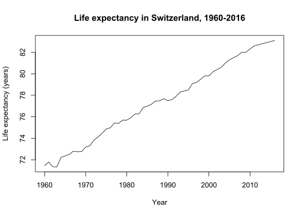
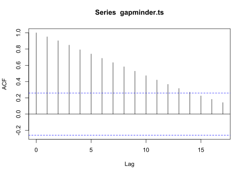

Report 10
================
Nathan Bana
(15 May, 2022)

-   [Dataset](#dataset)
-   [Analysis](#analysis)

This report uses the following R packages:

``` r
library(tidyverse)
library(knitr)
library(dslabs)
```

# Dataset

We will be using the `gapminder` dataset from the `dslabs` package. This
dataset contains health and income outcomes for 184 countries from 1960
to 2016. More precisely, it contains the following 9 variables:

-   country.
-   year.
-   infant_mortality. Infant deaths per 1000.
-   life_expectancy. Life expectancy in years.
-   fertility. Average number of children per woman.
-   population. Country population.
-   gpd. GDP according to World Bankdev.
-   continent.
-   region. Geographical region.

Let’s take a look at the data types:

``` r
str(gapminder)
```

    ## 'data.frame':    10545 obs. of  9 variables:
    ##  $ country         : Factor w/ 185 levels "Albania","Algeria",..: 1 2 3 4 5 6 7 8 9 10 ...
    ##  $ year            : int  1960 1960 1960 1960 1960 1960 1960 1960 1960 1960 ...
    ##  $ infant_mortality: num  115.4 148.2 208 NA 59.9 ...
    ##  $ life_expectancy : num  62.9 47.5 36 63 65.4 ...
    ##  $ fertility       : num  6.19 7.65 7.32 4.43 3.11 4.55 4.82 3.45 2.7 5.57 ...
    ##  $ population      : num  1636054 11124892 5270844 54681 20619075 ...
    ##  $ gdp             : num  NA 1.38e+10 NA NA 1.08e+11 ...
    ##  $ continent       : Factor w/ 5 levels "Africa","Americas",..: 4 1 1 2 2 3 2 5 4 3 ...
    ##  $ region          : Factor w/ 22 levels "Australia and New Zealand",..: 19 11 10 2 15 21 2 1 22 21 ...

We can see that there are 5 numeric vectors, 3 factors and 1 integer
vector. For this report about time series analysis, I am only interested
in the evolution of life expectancy across time in Switzerland. Let us
filter the data accordingly:

``` r
gapminder.filtered <- gapminder %>% 
  filter(country == "Switzerland") %>% 
  select(year, life_expectancy)
str(gapminder.filtered)
```

    ## 'data.frame':    57 obs. of  2 variables:
    ##  $ year           : int  1960 1961 1962 1963 1964 1965 1966 1967 1968 1969 ...
    ##  $ life_expectancy: num  71.5 71.8 71.3 71.3 72.2 ...

``` r
kable(head(gapminder.filtered))
```

| year | life_expectancy |
|-----:|----------------:|
| 1960 |           71.46 |
| 1961 |           71.79 |
| 1962 |           71.35 |
| 1963 |           71.34 |
| 1964 |           72.23 |
| 1965 |           72.36 |

# Analysis

Now, let us create a time series object with our data and plot it:

``` r
gapminder.ts <- ts(gapminder.filtered$life_expectancy, 1960, 2016)
ts.plot(gapminder.ts, xlab = "Year", ylab = "Life expectancy (years)", 
        main = "Life expectancy in Switzerland, 1960-2016")
```

<!-- -->

We can observe that life expectancy has been steadily increasing in
Switzerland since 1960.

Now let us plot the autocorrelation:

``` r
acf(gapminder.ts)
```

<!-- -->

We can see that the autocorrelation is very positively strong overall,
meaning that the time series is strongly dependent on its past, and that
when life expectancy is high on any given year, it tends to be also high
the preceding year (for lag 1).

Next, let us fit the autoregressive (AR) model to our data and try to
predict the future of our time series:

``` r
gapminder.ar <- arima(gapminder.ts, order = c(1, 0, 0))
predict(gapminder.ar, n.ahead = 10)
```

    ## $pred
    ## Time Series:
    ## Start = 2017 
    ## End = 2026 
    ## Frequency = 1 
    ##  [1] 83.09230 83.08462 83.07695 83.06928 83.06163 83.05398 83.04635 83.03872
    ##  [9] 83.03111 83.02351
    ## 
    ## $se
    ## Time Series:
    ## Start = 2017 
    ## End = 2026 
    ## Frequency = 1 
    ##  [1] 0.2931100 0.4142453 0.5070085 0.5850552 0.6536784 0.7155949 0.7724195
    ##  [8] 0.8252051 0.8746836 0.9213883

Hmm. The model predicts that life expectancy will go down in Switzerland
from 2017 to 2026. It is very curious given the data that we fed it…

Let us try fitting the simple moving average (MA) model to our data
instead, and try to predict the future with that:

``` r
gapminder.ma <- arima(gapminder.ts, order = c(0, 0, 1))
predict(gapminder.ma, n.ahead = 10)
```

    ## $pred
    ## Time Series:
    ## Start = 2017 
    ## End = 2026 
    ## Frequency = 1 
    ##  [1] 80.26894 77.36925 77.36925 77.36925 77.36925 77.36925 77.36925 77.36925
    ##  [9] 77.36925 77.36925
    ## 
    ## $se
    ## Time Series:
    ## Start = 2017 
    ## End = 2026 
    ## Frequency = 1 
    ##  [1] 1.864542 2.614419 2.614419 2.614419 2.614419 2.614419 2.614419 2.614419
    ##  [9] 2.614419 2.614419

Well now the results are even weirder…
