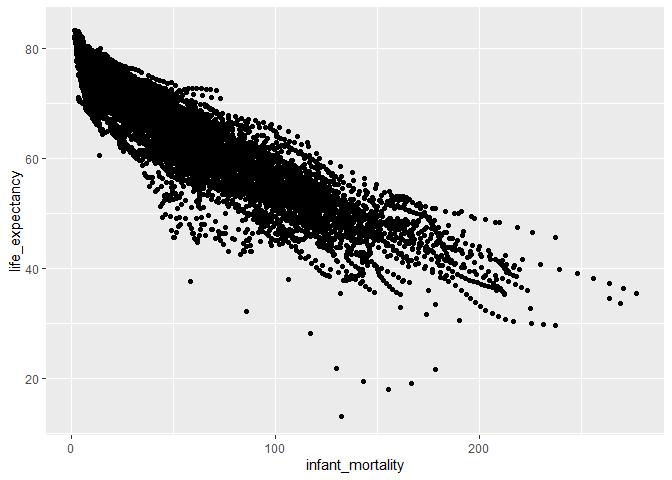

Report 4
================
Nathan Bana
(26 March, 2022)

This report uses the following R packages:

``` r
library(tidyverse)
library(knitr)
library(dslabs)
```

We will be using the `gapminder` dataset from the `dslabs` package. This
dataset contains health and income outcomes for 184 countries from 1960
to 2016. More precisely, it contains the following 9 variables:

-   country.
-   year.
-   infant_mortality. Infant deaths per 1000.
-   life_expectancy. Life expectancy in years.
-   fertility. Average number of children per woman.
-   population. Country population.
-   gpd. GDP according to World Bankdev.
-   continent.
-   region. Geographical region.

Let’s take a look at the data types:

``` r
str(gapminder)
```

    ## 'data.frame':    10545 obs. of  9 variables:
    ##  $ country         : Factor w/ 185 levels "Albania","Algeria",..: 1 2 3 4 5 6 7 8 9 10 ...
    ##  $ year            : int  1960 1960 1960 1960 1960 1960 1960 1960 1960 1960 ...
    ##  $ infant_mortality: num  115.4 148.2 208 NA 59.9 ...
    ##  $ life_expectancy : num  62.9 47.5 36 63 65.4 ...
    ##  $ fertility       : num  6.19 7.65 7.32 4.43 3.11 4.55 4.82 3.45 2.7 5.57 ...
    ##  $ population      : num  1636054 11124892 5270844 54681 20619075 ...
    ##  $ gdp             : num  NA 1.38e+10 NA NA 1.08e+11 ...
    ##  $ continent       : Factor w/ 5 levels "Africa","Americas",..: 4 1 1 2 2 3 2 5 4 3 ...
    ##  $ region          : Factor w/ 22 levels "Australia and New Zealand",..: 19 11 10 2 15 21 2 1 22 21 ...

We can see that there are 5 numeric vectors, 3 factors and 1 integer
vector. Let’s transform the dataset into long format:

``` r
gapminder_long <- gapminder %>% 
  pivot_longer(c("infant_mortality", "life_expectancy", "fertility", "population", "gdp"), names_to = "variable")
gapminder_long %>% head() %>% kable()
```

| country | year | continent | region          | variable         |      value |
|:--------|-----:|:----------|:----------------|:-----------------|-----------:|
| Albania | 1960 | Europe    | Southern Europe | infant_mortality |     115.40 |
| Albania | 1960 | Europe    | Southern Europe | life_expectancy  |      62.87 |
| Albania | 1960 | Europe    | Southern Europe | fertility        |       6.19 |
| Albania | 1960 | Europe    | Southern Europe | population       | 1636054.00 |
| Albania | 1960 | Europe    | Southern Europe | gdp              |         NA |
| Algeria | 1960 | Africa    | Northern Africa | infant_mortality |     148.20 |

Now, let’s unite the continent and region columns:

``` r
gapminder_long <- gapminder_long %>% 
  unite(cont_region, continent, region)
gapminder_long %>% head() %>% kable()
```

| country | year | cont_region            | variable         |      value |
|:--------|-----:|:-----------------------|:-----------------|-----------:|
| Albania | 1960 | Europe_Southern Europe | infant_mortality |     115.40 |
| Albania | 1960 | Europe_Southern Europe | life_expectancy  |      62.87 |
| Albania | 1960 | Europe_Southern Europe | fertility        |       6.19 |
| Albania | 1960 | Europe_Southern Europe | population       | 1636054.00 |
| Albania | 1960 | Europe_Southern Europe | gdp              |         NA |
| Algeria | 1960 | Africa_Northern Africa | infant_mortality |     148.20 |

Actually, I regret everything. Let’s revert the change:

``` r
gapminder_long <- gapminder_long %>% 
  separate(cont_region, into=c("continent", "region"), sep="_")
gapminder_long %>% head() %>% kable()
```

| country | year | continent | region          | variable         |      value |
|:--------|-----:|:----------|:----------------|:-----------------|-----------:|
| Albania | 1960 | Europe    | Southern Europe | infant_mortality |     115.40 |
| Albania | 1960 | Europe    | Southern Europe | life_expectancy  |      62.87 |
| Albania | 1960 | Europe    | Southern Europe | fertility        |       6.19 |
| Albania | 1960 | Europe    | Southern Europe | population       | 1636054.00 |
| Albania | 1960 | Europe    | Southern Europe | gdp              |         NA |
| Algeria | 1960 | Africa    | Northern Africa | infant_mortality |     148.20 |

Finally, using our original `gapminder` dataset, let’s plot infant
mortality against life expectancy:

``` r
ggplot(gapminder, aes(infant_mortality, life_expectancy)) +
  geom_point()
```

<!-- -->
