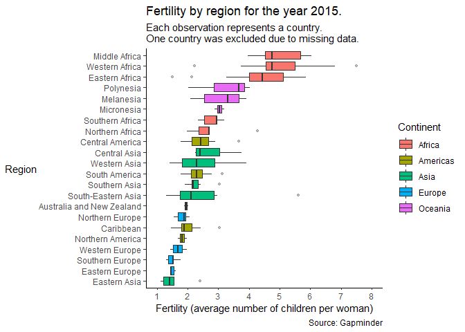
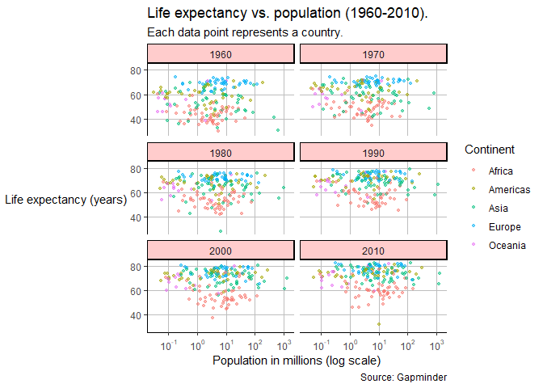

Report 5
================
Nathan Bana
(02 April, 2022)

-   [Fertility by region](#fertility-by-region)
-   [Life expectancy vs. population](#life-expectancy-vs-population)

This report uses the following R packages:

``` r
library(tidyverse)
library(knitr)
library(dslabs)
library(scales)
```

We will be using the `gapminder` dataset from the `dslabs` package. This
dataset contains health and income outcomes for 184 countries from 1960
to 2016. More precisely, it contains the following 9 variables:

-   country.
-   year.
-   infant_mortality. Infant deaths per 1000.
-   life_expectancy. Life expectancy in years.
-   fertility. Average number of children per woman.
-   population. Country population.
-   gpd. GDP according to World Bankdev.
-   continent.
-   region. Geographical region.

Let’s take a look at the data types:

``` r
str(gapminder)
```

    ## 'data.frame':    10545 obs. of  9 variables:
    ##  $ country         : Factor w/ 185 levels "Albania","Algeria",..: 1 2 3 4 5 6 7 8 9 10 ...
    ##  $ year            : int  1960 1960 1960 1960 1960 1960 1960 1960 1960 1960 ...
    ##  $ infant_mortality: num  115.4 148.2 208 NA 59.9 ...
    ##  $ life_expectancy : num  62.9 47.5 36 63 65.4 ...
    ##  $ fertility       : num  6.19 7.65 7.32 4.43 3.11 4.55 4.82 3.45 2.7 5.57 ...
    ##  $ population      : num  1636054 11124892 5270844 54681 20619075 ...
    ##  $ gdp             : num  NA 1.38e+10 NA NA 1.08e+11 ...
    ##  $ continent       : Factor w/ 5 levels "Africa","Americas",..: 4 1 1 2 2 3 2 5 4 3 ...
    ##  $ region          : Factor w/ 22 levels "Australia and New Zealand",..: 19 11 10 2 15 21 2 1 22 21 ...

We can see that there are 5 numeric vectors, 3 factors and 1 integer
vector.

## Fertility by region

I want to know the distribution of fertility by region for the year
2015, arranged in ascending order by the median. Our first step is
filtering the data to include only the year 2015.

``` r
gapminder2015 <- filter(gapminder, year == 2015)
kable(head(gapminder2015))
```

| country             | year | infant_mortality | life_expectancy | fertility | population | gdp | continent | region          |
|:--------------------|-----:|-----------------:|----------------:|----------:|-----------:|----:|:----------|:----------------|
| Albania             | 2015 |             12.5 |            78.0 |      1.78 |    2896679 |  NA | Europe    | Southern Europe |
| Algeria             | 2015 |             21.9 |            76.4 |      2.71 |   39666519 |  NA | Africa    | Northern Africa |
| Angola              | 2015 |             96.0 |            59.6 |      5.65 |   25021974 |  NA | Africa    | Middle Africa   |
| Antigua and Barbuda | 2015 |              5.8 |            76.4 |      2.06 |      91818 |  NA | Americas  | Caribbean       |
| Argentina           | 2015 |             11.1 |            76.5 |      2.15 |   43416755 |  NA | Americas  | South America   |
| Armenia             | 2015 |             12.6 |            74.7 |      1.41 |    3017712 |  NA | Asia      | Western Asia    |

``` r
str(gapminder2015)
```

    ## 'data.frame':    185 obs. of  9 variables:
    ##  $ country         : Factor w/ 185 levels "Albania","Algeria",..: 1 2 3 4 5 6 7 8 9 10 ...
    ##  $ year            : int  2015 2015 2015 2015 2015 2015 2015 2015 2015 2015 ...
    ##  $ infant_mortality: num  12.5 21.9 96 5.8 11.1 12.6 NA 3 2.9 27.9 ...
    ##  $ life_expectancy : num  78 76.4 59.6 76.4 76.5 ...
    ##  $ fertility       : num  1.78 2.71 5.65 2.06 2.15 1.41 1.66 1.88 1.5 1.89 ...
    ##  $ population      : num  2896679 39666519 25021974 91818 43416755 ...
    ##  $ gdp             : num  NA NA NA NA NA NA NA NA NA NA ...
    ##  $ continent       : Factor w/ 5 levels "Africa","Americas",..: 4 1 1 2 2 3 2 5 4 3 ...
    ##  $ region          : Factor w/ 22 levels "Australia and New Zealand",..: 19 11 10 2 15 21 2 1 22 21 ...

Now we can use this filtered data set to create our plot:

``` r
ggplot(gapminder2015, aes(reorder(region, fertility, na.rm = T, FUN = median), fertility, fill=continent)) +
  geom_boxplot(outlier.alpha = 0.3, outlier.size = 1) +
  scale_y_continuous(limits = c(1,8),
                     breaks = seq(1,8,1)) +
  labs(x = "Region",
       y = "Fertility (average number of children per woman)",
       fill = "Continent",
       title = "Fertility by region for the year 2015.",
       subtitle = "Each observation represents a country.\nOne country was excluded due to missing data.",
       caption = "Source: Gapminder") +
  coord_flip() +
  theme_classic() +
  theme(
    axis.title.y = element_text(angle = 0, vjust = 0.5)
  )
```

<!-- -->

It is clear from the plot that African countries tend to have higher
fertility than Western countries.

## Life expectancy vs. population

For our next plot, I want to explore the relationship between life
expectancy and population for each continent. I will focus on 6 specific
years: 1960, 1970, 1980, 1990, 2000 and 2010. Our first step is
filtering the data to include only the years of interest.

``` r
gapminder1960_2010 <- filter(gapminder, year %in% c("1960", "1970", "1980", "1990", "2000", "2010"))
kable(head(gapminder1960_2010))
```

| country             | year | infant_mortality | life_expectancy | fertility | population |          gdp | continent | region          |
|:--------------------|-----:|-----------------:|----------------:|----------:|-----------:|-------------:|:----------|:----------------|
| Albania             | 1960 |           115.40 |           62.87 |      6.19 |    1636054 |           NA | Europe    | Southern Europe |
| Algeria             | 1960 |           148.20 |           47.50 |      7.65 |   11124892 |  13828152297 | Africa    | Northern Africa |
| Angola              | 1960 |           208.00 |           35.98 |      7.32 |    5270844 |           NA | Africa    | Middle Africa   |
| Antigua and Barbuda | 1960 |               NA |           62.97 |      4.43 |      54681 |           NA | Americas  | Caribbean       |
| Argentina           | 1960 |            59.87 |           65.39 |      3.11 |   20619075 | 108322326649 | Americas  | South America   |
| Armenia             | 1960 |               NA |           66.86 |      4.55 |    1867396 |           NA | Asia      | Western Asia    |

``` r
str(gapminder1960_2010)
```

    ## 'data.frame':    1110 obs. of  9 variables:
    ##  $ country         : Factor w/ 185 levels "Albania","Algeria",..: 1 2 3 4 5 6 7 8 9 10 ...
    ##  $ year            : int  1960 1960 1960 1960 1960 1960 1960 1960 1960 1960 ...
    ##  $ infant_mortality: num  115.4 148.2 208 NA 59.9 ...
    ##  $ life_expectancy : num  62.9 47.5 36 63 65.4 ...
    ##  $ fertility       : num  6.19 7.65 7.32 4.43 3.11 4.55 4.82 3.45 2.7 5.57 ...
    ##  $ population      : num  1636054 11124892 5270844 54681 20619075 ...
    ##  $ gdp             : num  NA 1.38e+10 NA NA 1.08e+11 ...
    ##  $ continent       : Factor w/ 5 levels "Africa","Americas",..: 4 1 1 2 2 3 2 5 4 3 ...
    ##  $ region          : Factor w/ 22 levels "Australia and New Zealand",..: 19 11 10 2 15 21 2 1 22 21 ...

Now we can use this filtered data set to create our plot:

``` r
ggplot(gapminder1960_2010, aes(population/10^6, life_expectancy, color = continent)) +
  geom_point(size = 1, alpha = 0.5) +
  scale_x_continuous(trans='log10',
                     breaks=trans_breaks('log10', function(x) 10^x),
                     labels=trans_format('log10', math_format(10^.x))) +
  labs(x = "Population in millions (log scale)",
       y = "Life expectancy (years)",
       color = "Continent",
       title = "Life expectancy vs. population (1960-2010).",
       subtitle = "Each data point represents a country.",
       caption = "Source: Gapminder") +
  facet_wrap(vars(year), ncol = 2) +
  theme_classic() +
  theme(
    axis.title.y = element_text(angle = 0, vjust = 0.5),
    panel.grid.major = element_line(color = "grey"),
    strip.background = element_rect(fill = "#ffcccc")
  )
```

<!-- -->

We can see that there does not seem to be a relationship between
population and life expectancy. It is nevertheless interesting to see
that from 1960 to 2010, life expectancy increased considerably almost
everywhere on the planet. We can also see that Europe has always had the
highest life expectancy, and Africa the lowest.
