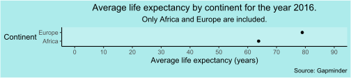
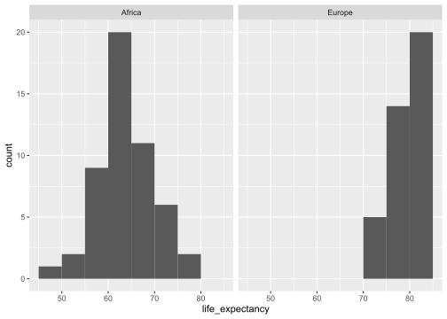

Report 6
================
Nathan Bana
(09 April, 2022)

This report uses the following R packages:

``` r
library(tidyverse)
library(knitr)
library(dslabs)
```

We will be using the `gapminder` dataset from the `dslabs` package. This
dataset contains health and income outcomes for 184 countries from 1960
to 2016. More precisely, it contains the following 9 variables:

-   country.
-   year.
-   infant_mortality. Infant deaths per 1000.
-   life_expectancy. Life expectancy in years.
-   fertility. Average number of children per woman.
-   population. Country population.
-   gpd. GDP according to World Bankdev.
-   continent.
-   region. Geographical region.

Let’s take a look at the data types:

``` r
str(gapminder)
```

    ## 'data.frame':    10545 obs. of  9 variables:
    ##  $ country         : Factor w/ 185 levels "Albania","Algeria",..: 1 2 3 4 5 6 7 8 9 10 ...
    ##  $ year            : int  1960 1960 1960 1960 1960 1960 1960 1960 1960 1960 ...
    ##  $ infant_mortality: num  115.4 148.2 208 NA 59.9 ...
    ##  $ life_expectancy : num  62.9 47.5 36 63 65.4 ...
    ##  $ fertility       : num  6.19 7.65 7.32 4.43 3.11 4.55 4.82 3.45 2.7 5.57 ...
    ##  $ population      : num  1636054 11124892 5270844 54681 20619075 ...
    ##  $ gdp             : num  NA 1.38e+10 NA NA 1.08e+11 ...
    ##  $ continent       : Factor w/ 5 levels "Africa","Americas",..: 4 1 1 2 2 3 2 5 4 3 ...
    ##  $ region          : Factor w/ 22 levels "Australia and New Zealand",..: 19 11 10 2 15 21 2 1 22 21 ...

We can see that there are 5 numeric vectors, 3 factors and 1 integer
vector. The question I want to answer is whether the average life
expectancy is different between African and European countries for the
year 2016. First, let’s filter the `gapminder` dataset so that it only
includes observations of African and European countries for the year
2016:

``` r
gapminder2 <- gapminder %>%
  filter(continent %in% c("Africa","Europe"), year==2016)
str(gapminder2)
```

    ## 'data.frame':    90 obs. of  9 variables:
    ##  $ country         : Factor w/ 185 levels "Albania","Algeria",..: 1 2 3 9 15 16 18 21 22 25 ...
    ##  $ year            : int  2016 2016 2016 2016 2016 2016 2016 2016 2016 2016 ...
    ##  $ infant_mortality: num  NA NA NA NA NA NA NA NA NA NA ...
    ##  $ life_expectancy : num  78.1 76.5 60 81.4 71.3 ...
    ##  $ fertility       : num  NA NA NA NA NA NA NA NA NA NA ...
    ##  $ population      : num  NA NA NA NA NA NA NA NA NA NA ...
    ##  $ gdp             : num  NA NA NA NA NA NA NA NA NA NA ...
    ##  $ continent       : Factor w/ 5 levels "Africa","Americas",..: 4 1 1 4 4 4 1 4 1 4 ...
    ##  $ region          : Factor w/ 22 levels "Australia and New Zealand",..: 19 11 10 22 7 22 20 19 17 7 ...

Now, we have what we need to create a plot of the average life
expectancy by continent:

``` r
ggplot(gapminder2, aes(life_expectancy, continent)) + 
  stat_summary(fun = mean, geom = "point") +
  scale_x_continuous(limits = c(0,90),
                     breaks = seq(0,90,10)) +
  labs(y = "Continent",
       x = "Average life expectancy (years)",
       title = "Average life expectancy by continent for the year 2016.",
       subtitle = "Only Africa and Europe are included.",
       caption = "Source: Gapminder") +
  coord_fixed(3) +
  theme_classic() +
  theme(
    axis.title.y = element_text(angle = 0, vjust = 0.5),
    plot.title = element_text(hjust = 0.5),
    plot.subtitle = element_text(hjust = 0.5),
    rect = element_rect(fill = "#adebeb"),
    panel.background = element_rect(fill = "#c1f0f0")
  )
```

<!-- -->

We can see that the average life expectancy is clearly different between
Europe and Africa. Furthermore, given the large effect size and sample
size, we can already be pretty sure that this difference is
statistically significant. But let’s still run a hypothesis test, just
for fun (woo-hoo!).

To compare 2 means, we would have to run a t-test. First, let’s visually
check the normality assumption:

``` r
ggplot(gapminder2, aes(life_expectancy)) +
  geom_histogram(binwidth = 5,
                 center=2.5) +
  facet_grid(cols = vars(continent))
```

<!-- -->

Uh-oh! Africa looks fine, but Europe is another story. Let’s run a
Shapiro-Wilk test to be sure:

``` r
gapminder_europe <- gapminder %>%
  filter(continent == "Europe", year==2016)
shapiro.test(gapminder_europe$life_expectancy)
```

    ## 
    ##  Shapiro-Wilk normality test
    ## 
    ## data:  gapminder_europe$life_expectancy
    ## W = 0.90855, p-value = 0.003915

Yikes. The test is significant, meaning the data are very probably not
normally distributed. Fortunately, we can just use a nonparametric test
like the Wilcoxon test to compare our 2 means:

``` r
wilcox.test(life_expectancy ~ continent, gapminder2)
```

    ## 
    ##  Wilcoxon rank sum test with continuity correction
    ## 
    ## data:  life_expectancy by continent
    ## W = 40.5, p-value = 8.21e-15
    ## alternative hypothesis: true location shift is not equal to 0

The test is significant (*p*=8.21e-15), meaning we can safely reject the
null hypothesis that the population means are identical. We can conclude
that the difference in means between the two continents is not due to
chance.
