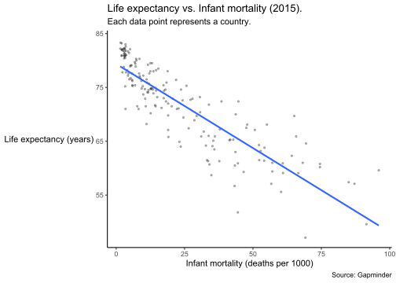

Report 7
================
Nathan Bana
(29 April, 2022)

-   [Dataset](#dataset)
-   [Analysis](#analysis)

This report uses the following R packages:

``` r
library(tidyverse)
library(knitr)
library(dslabs)
```

# Dataset

We will be using the `gapminder` dataset from the `dslabs` package. This
dataset contains health and income outcomes for 184 countries from 1960
to 2016. More precisely, it contains the following 9 variables:

-   country.
-   year.
-   infant_mortality. Infant deaths per 1000.
-   life_expectancy. Life expectancy in years.
-   fertility. Average number of children per woman.
-   population. Country population.
-   gpd. GDP according to World Bankdev.
-   continent.
-   region. Geographical region.

Let’s take a look at the data types:

``` r
str(gapminder)
```

    ## 'data.frame':    10545 obs. of  9 variables:
    ##  $ country         : Factor w/ 185 levels "Albania","Algeria",..: 1 2 3 4 5 6 7 8 9 10 ...
    ##  $ year            : int  1960 1960 1960 1960 1960 1960 1960 1960 1960 1960 ...
    ##  $ infant_mortality: num  115.4 148.2 208 NA 59.9 ...
    ##  $ life_expectancy : num  62.9 47.5 36 63 65.4 ...
    ##  $ fertility       : num  6.19 7.65 7.32 4.43 3.11 4.55 4.82 3.45 2.7 5.57 ...
    ##  $ population      : num  1636054 11124892 5270844 54681 20619075 ...
    ##  $ gdp             : num  NA 1.38e+10 NA NA 1.08e+11 ...
    ##  $ continent       : Factor w/ 5 levels "Africa","Americas",..: 4 1 1 2 2 3 2 5 4 3 ...
    ##  $ region          : Factor w/ 22 levels "Australia and New Zealand",..: 19 11 10 2 15 21 2 1 22 21 ...

We can see that there are 5 numeric vectors, 3 factors and 1 integer
vector.

# Analysis

I want to explore the relationship between life expectancy and infant
mortality for the year 2015. First, let’s filter the `gapminder` dataset
so that it only includes observations for the year 2015:

``` r
gapminder2 <- gapminder %>%
  filter(year==2015)
str(gapminder2)
```

    ## 'data.frame':    185 obs. of  9 variables:
    ##  $ country         : Factor w/ 185 levels "Albania","Algeria",..: 1 2 3 4 5 6 7 8 9 10 ...
    ##  $ year            : int  2015 2015 2015 2015 2015 2015 2015 2015 2015 2015 ...
    ##  $ infant_mortality: num  12.5 21.9 96 5.8 11.1 12.6 NA 3 2.9 27.9 ...
    ##  $ life_expectancy : num  78 76.4 59.6 76.4 76.5 ...
    ##  $ fertility       : num  1.78 2.71 5.65 2.06 2.15 1.41 1.66 1.88 1.5 1.89 ...
    ##  $ population      : num  2896679 39666519 25021974 91818 43416755 ...
    ##  $ gdp             : num  NA NA NA NA NA NA NA NA NA NA ...
    ##  $ continent       : Factor w/ 5 levels "Africa","Americas",..: 4 1 1 2 2 3 2 5 4 3 ...
    ##  $ region          : Factor w/ 22 levels "Australia and New Zealand",..: 19 11 10 2 15 21 2 1 22 21 ...

Let us begin by plotting life expectancy against infant mortality:

``` r
ggplot(gapminder2, aes(infant_mortality, life_expectancy)) +
  geom_point(size = 0.8, alpha = 0.3) +
  geom_smooth(method = "lm", se=0) +
  labs(x = "Infant mortality (deaths per 1000)",
       y = "Life expectancy (years)",
       title = "Life expectancy vs. Infant mortality (2015).",
       subtitle = "Each data point represents a country.",
       caption = "Source: Gapminder") +
  theme_classic() +
  theme(
    axis.title.y = element_text(angle = 0, vjust = 0.5)
  )
```

    ## `geom_smooth()` using formula 'y ~ x'

    ## Warning: Removed 7 rows containing non-finite values (stat_smooth).

    ## Warning: Removed 7 rows containing missing values (geom_point).

<!-- -->

There seems to be a clear linear relationship between these 2 variables.
Let’s compute Pearson’s *r* to quantify this relationship:

``` r
cor(gapminder2$infant_mortality, gapminder2$life_expectancy, use = "pairwise.complete.obs")
```

    ## [1] -0.8683967

We see that there is a strong negative linear relationship between life
expectancy and infant mortality. After all, it only makes sense that
higher infant mortality would cause life expectancy to be lower, since
the latter is a measure of the average time an individual is expected to
live.

Now, let us fit a linear model to the data, with life expectancy as the
outcome and infant mortality as the predictor:

``` r
mod <- lm(life_expectancy ~ infant_mortality, gapminder2)
summary(mod)
```

    ## 
    ## Call:
    ## lm(formula = life_expectancy ~ infant_mortality, data = gapminder2)
    ## 
    ## Residuals:
    ##      Min       1Q   Median       3Q      Max 
    ## -13.6546  -1.7776   0.0802   2.9891  10.6826 
    ## 
    ## Coefficients:
    ##                  Estimate Std. Error t value Pr(>|t|)    
    ## (Intercept)      79.36026    0.43092  184.16   <2e-16 ***
    ## infant_mortality -0.31249    0.01345  -23.23   <2e-16 ***
    ## ---
    ## Signif. codes:  0 '***' 0.001 '**' 0.01 '*' 0.05 '.' 0.1 ' ' 1
    ## 
    ## Residual standard error: 3.895 on 176 degrees of freedom
    ##   (7 observations deleted due to missingness)
    ## Multiple R-squared:  0.7541, Adjusted R-squared:  0.7527 
    ## F-statistic: 539.8 on 1 and 176 DF,  p-value: < 2.2e-16

According to our model, in 2015, a country is expected to lose about .3
years of life expectancy for every additional infant death per 1000.
Given the R-squared value, we can also see that our model does a pretty
good job, as it explains about 75% of the variance in life expectancy.
